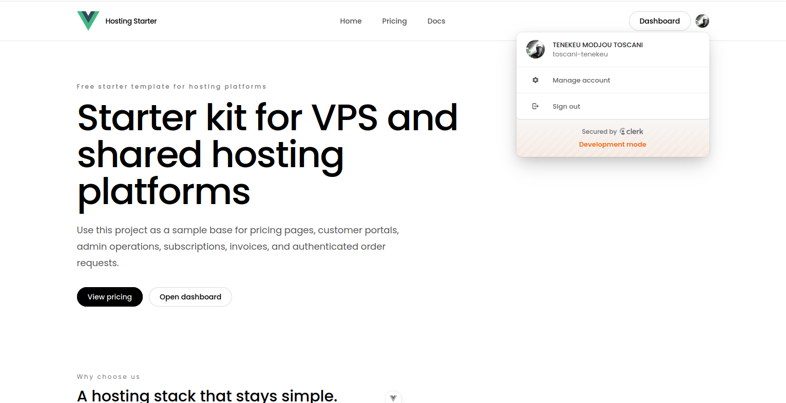
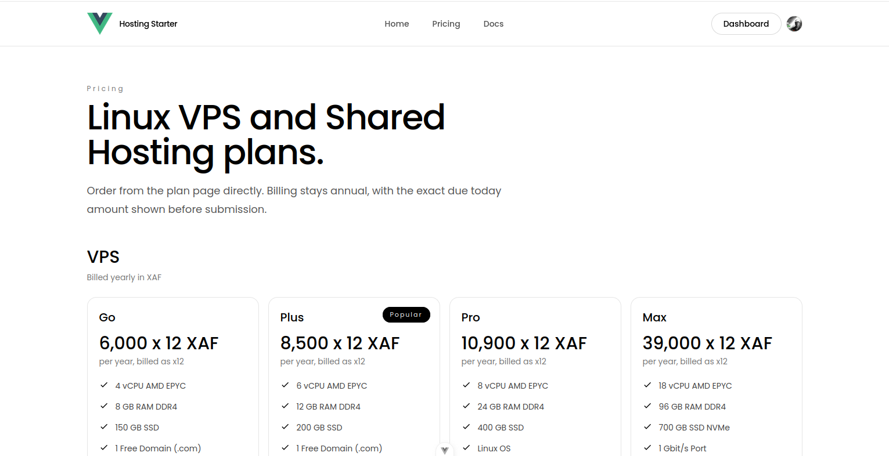
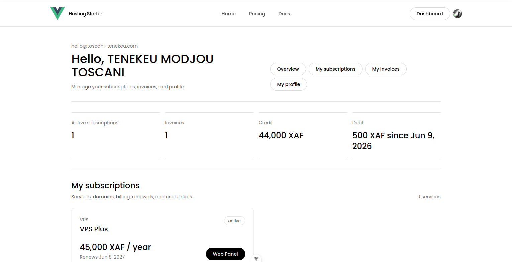
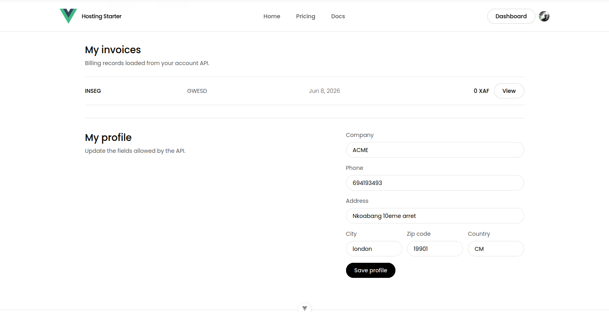
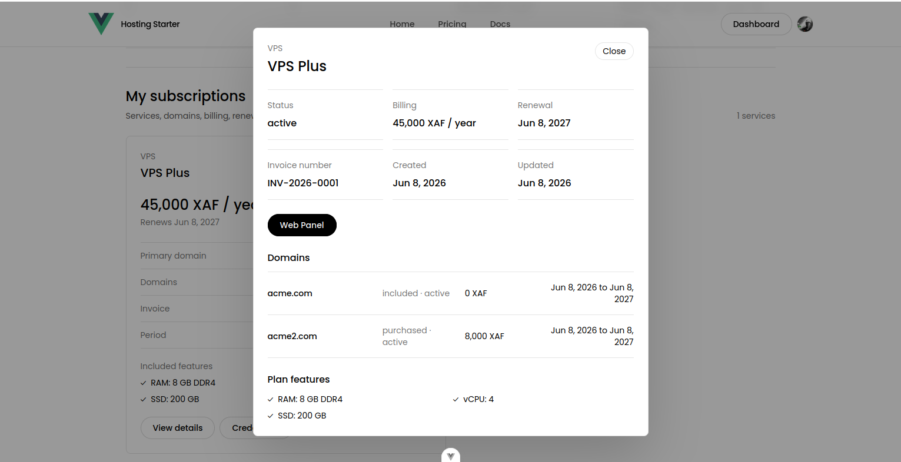
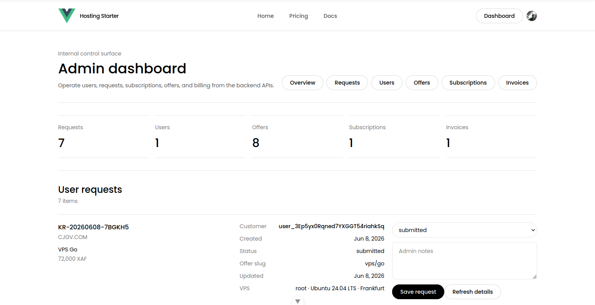

# Fullstack Hosting Platform Starter — MEVN Stack

A full-stack starter for building a web hosting business platform. The Vue frontend and Express/MongoDB backend live in one repository and share a single development workflow.

## Technology Stack

| Layer | Technologies | Location |
| --- | --- | --- |
| Frontend | Vue 3, Vite, TypeScript, Pinia, Tailwind CSS | Repository root |
| Backend | Node.js, Express 5, TypeScript, Mongoose, Zod | `backend/` |
| Database | MongoDB | External or local instance |
| Authentication | Clerk | Frontend and backend |
| API documentation | OpenAPI and Swagger UI | `backend/src/openapi.ts` |
| Testing | Vitest, Supertest, Playwright | Root and `backend/tests/` |

## Project Structure

```text
.
├── backend/          # Express API, MongoDB models, services and tests
├── docs/images/      # Project screenshots
├── e2e/              # Playwright end-to-end tests
├── public/           # Frontend public assets
├── src/              # Vue application
├── .env.example      # Frontend environment template
└── package.json      # Shared scripts and npm workspace configuration
```

## Features

- Public hosting website and pricing pages
- Clerk sign-in and sign-up
- Customer profiles, credit and debt tracking
- Hosting offers and order requests
- Subscription and invoice management
- Customer and administrator dashboards
- Admin operations and role assignment
- OpenAPI documentation and Swagger UI
- Shared Hosting and VPS service support

## Screenshots

<table>
  <tr>
    <td width="50%">
      <strong>Home page</strong><br>
      
    </td>
    <td width="50%">
      <strong>Pricing page</strong><br>
      
    </td>
  </tr>
  <tr>
    <td width="50%">
      <strong>Customer dashboard</strong><br>
      
    </td>
    <td width="50%">
      <strong>Customer profile and invoices</strong><br>
      
    </td>
  </tr>
  <tr>
    <td width="50%">
      <strong>Subscription details</strong><br>
      
    </td>
    <td width="50%">
      <strong>Admin dashboard</strong><br>
      
    </td>
  </tr>
</table>

## Requirements

- Node.js `20.19.0` or newer (`24.x` recommended)
- npm `11.x` recommended
- MongoDB connection URI
- Clerk application keys

## Quick Start

```bash
git clone https://github.com/toscani-tenekeu/Fullstack_Hosting_Plateform_Starter_MEVN_Stack.git
cd Fullstack_Hosting_Plateform_Starter_MEVN_Stack
npm install
cp .env.example .env
cp backend/.env.example backend/.env
```

Configure the frontend in `.env`:

```env
VITE_CLERK_PUBLISHABLE_KEY=your_clerk_publishable_key
VITE_API_BASE_URL=http://localhost:3000
```

Configure the API in `backend/.env`:

```env
PORT=3000
CLIENT_ORIGINS=http://localhost:5173,http://127.0.0.1:5173
MONGODB_URI=mongodb://127.0.0.1:27017/hosting-platform
CLERK_PUBLISHABLE_KEY=your_clerk_publishable_key
CLERK_SECRET_KEY=your_clerk_secret_key
CLERK_WEBHOOK_SIGNING_SECRET=your_clerk_webhook_signing_secret
```

Start the frontend and backend together:

```bash
npm run dev
```

The services will be available at:

- Frontend: `http://localhost:5173`
- API health check: `http://localhost:3000/health`
- Swagger UI: `http://localhost:3000/api/docs`
- OpenAPI JSON: `http://localhost:3000/api/openapi.json`

## Scripts

| Command | Purpose |
| --- | --- |
| `npm run dev` | Start the frontend and backend together |
| `npm run dev:frontend` | Start only the Vue development server |
| `npm run dev:backend` | Start only the Express API |
| `npm run build` | Build both applications |
| `npm test` | Run frontend and backend unit/API tests |
| `npm run test:e2e` | Run Playwright end-to-end tests |
| `npm run lint` | Lint the frontend source |
| `npm run seed:offers` | Seed the default hosting offers |
| `npm run setup:admin -- --email user@example.com` | Assign the admin role to an existing Clerk user |

## Notes

- The default currency is `XAF`.
- Payments are manual by default.
- Domain registration and DNS automation are not included.
- Replace the placeholder logo in `src/components/SiteHeader.vue` and `src/components/SiteFooter.vue`.

## License

Licensed under the [GNU General Public License v3.0](LICENSE).
