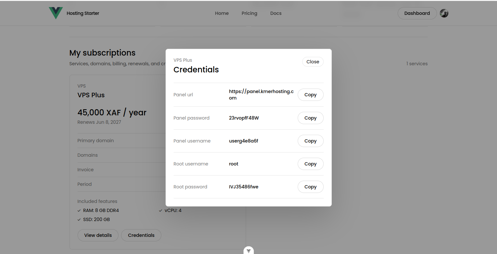
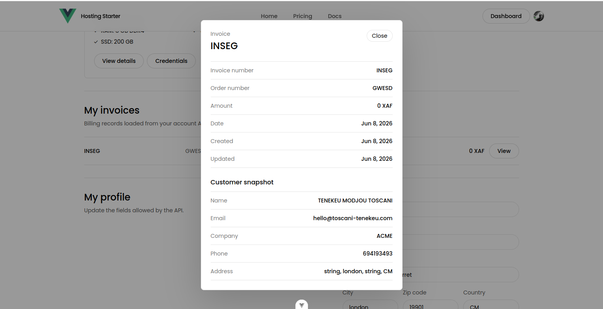

# Hosting Starter Frontend

<p>
  
  
  
  
</p>

Frontend part of a basic hosting infrastructure starter. It is intentionally simple and made for people who want to start a small hosting platform without deep hosting expertise at the beginning.

Backend part: [fullstack-hosting-plateform-express-mongodb-backend-part](https://github.com/toscani-tenekeu/fullstack-hosting-plateform-express-mongodb-backend-part)

This frontend provides the public website, pricing pages, Clerk authentication UI, customer dashboard, admin dashboard, subscription and invoice views, customer profile forms, order request UI, and admin controls.

By installing this project, you can start a simple hosting platform quickly. The software gives you the customer-facing website, pricing flow, dashboards, credit flow, order requests, and admin tools needed to begin operating.

To deliver real hosting access, you only need to pair it with a hosting control panel license such as DirectAdmin or cPanel/WHM. After creating a customer's hosting account in that panel, the administrator records the panel URL, username, password, and domain information in the database through the admin workflow. Customers can then order from this platform, open their hosting area with the `Web Panel` button, and retrieve their displayed credentials from the dashboard.

Domain registration and DNS automation are intentionally not included in this starter, which keeps the first setup simple and flexible. You can add registrar or DNS-provider integrations later when your workflow is ready.

## Screenshots

<table>
  <tr>
    <td width="50%">
      <strong>Home page</strong><br>
      
    </td>
    <td width="50%">
      <strong>Pricing page</strong><br>
      
    </td>
  </tr>
  <tr>
    <td width="50%">
      <strong>Customer dashboard overview</strong><br>
      
    </td>
    <td width="50%">
      <strong>Customer profile and invoices</strong><br>
      
    </td>
  </tr>
  <tr>
    <td width="50%">
      <strong>Customer subscription details</strong><br>
      
    </td>
    <td width="50%">
      <strong>Customer credentials modal</strong><br>
      
    </td>
  </tr>
  <tr>
    <td width="50%">
      <strong>Customer invoice details</strong><br>
      
    </td>
    <td width="50%">
      <strong>Admin dashboard overview</strong><br>
      
    </td>
  </tr>
</table>

## Requirements

- Node.js `24.16.0` LTS recommended
- npm `11.13.0` recommended
- Running backend API
- Clerk publishable key

## Setup

Clone the frontend repository:

```bash
git clone https://github.com/toscani-tenekeu/fullstack-hosting-plateform-vuejs-frontend-part.git
cd fullstack-hosting-plateform-vuejs-frontend-part
```

Install dependencies:

```bash
npm install
```

Create the environment file:

```bash
cp .env.example .env
```

Fill `.env`:

```env
VITE_CLERK_PUBLISHABLE_KEY=your_clerk_publishable_key
VITE_API_BASE_URL=http://localhost:3000
```

Run the development server:

```bash
npm run dev
```

Open:

```text
http://localhost:5173
```

## Environment

- `VITE_CLERK_PUBLISHABLE_KEY` - Clerk frontend key.
- `VITE_API_BASE_URL` - backend origin, for example `http://localhost:3000`.

Do not add `/api` to `VITE_API_BASE_URL`. API functions already include `/api/...`.

## Scripts

```bash
npm run dev
npm run build
npm run preview
npm run test:unit
npm run test:e2e
npm run lint
```

## Main Routes

- `/`
- `/pricing`
- `/pricing/:typeSlug/:planSlug`
- `/docs`
- `/terms-of-service`
- `/privacy-policy`
- `/sign-in`
- `/sign-up`
- `/user/dashboard/overview`
- `/user/dashboard/profile`
- `/user/dashboard/subscriptions`
- `/user/dashboard/subscriptions/:id`
- `/user/dashboard/invoices`
- `/user/dashboard/invoices/:id`
- `/admin/dashboard/overview`
- `/admin/dashboard/users`
- `/admin/dashboard/subscriptions`
- `/admin/dashboard/invoices`

## Backend Dependency

This frontend expects the backend API to expose:

- `GET /api/offers`
- `POST /api/me/order-requests`
- `GET /api/me`
- `PATCH /api/me/profile`
- `GET /api/me/subscriptions`
- `GET /api/me/invoices`
- `GET /api/admin/users`
- `GET|POST /api/admin/offers`
- `GET|POST /api/admin/subscriptions`
- `GET|POST /api/admin/invoices`
- `GET /api/admin/user-requests`

## Branding

The header and footer use the Vue.js logo as a placeholder. Replace it in:

- `src/components/SiteHeader.vue`
- `src/components/SiteFooter.vue`

```ts
const logoUrl = 'https://vuejs.org/images/logo.png'
```

## Payments and Credit

Payment methods are not implemented in the frontend. The customer does not pay through this app by default.

Manual starter flow:

- The customer pays outside the platform.
- The admin verifies the payment.
- The admin adds credit to the customer account from the admin dashboard.
- The customer uses that credit to submit an order request.
- The backend debits the order amount from the customer credit balance.

## Currency

The default currency is `XAF`.

To change the frontend currency:

1. Update `currency: 'XAF'` types in `src/lib/api.ts`.
2. Rename or update `formatXafAmount` and `formatOfferPrice` in `src/lib/api.ts`.
3. Update UI labels/placeholders that mention `XAF`.
4. Update client tests that expect `XAF`.
5. Make the same currency change in the backend.

## Ollama Design System

The current visual direction follows an Ollama Design System style: white canvas, strong black typography, pill buttons, thin borders, and clean documentation-like layouts.

## License

This project is open source under the MIT License.

It is free to use for personal and commercial purposes without asking for permission.

## Main Contributor

Main contributor: Toscani TENEKEU

Website: https://toscani-tenekeu.com
